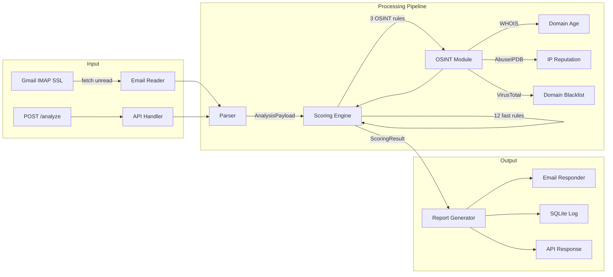

<p align="center">
  <h1 align="center">🛡️ PhishingCheck4U</h1>
  <p align="center">
    <strong>Hosted Email Phishing Detection & OSINT Intelligence Service</strong>
  </p>
  <p align="center">
    Rule-based scoring engine that analyzes 15+ email header features — SPF, DKIM, DMARC, X-Originating-IP, Reply-To mismatches, and more — enriched with real-time OSINT from WHOIS, AbuseIPDB, and VirusTotal.
  </p>
  <p align="center">
    
    
    
    
    
  </p>
</p>

---

## Why This Exists

Most email security tools are black boxes. PhishingCheck4U is a **transparent, rule-based detection engine** that explains *why* an email is suspicious — not just *that* it is. Every analysis produces a detailed report breaking down which rules fired, what OSINT intelligence was gathered, and how the final risk score was computed.

Built for security teams, bug bounty hunters, and anyone who needs to triage suspicious emails with full visibility into the decision logic.

---

## What It Detects

### Email Authentication Failures
| Rule | Points | What It Catches |
|------|--------|-----------------|
| **SPF Failure** | 18 pts | Sender IP not authorized by domain's SPF record |
| **SPF None** | 8 pts | Domain has no SPF record at all |
| **DKIM Failure** | 15 pts | DKIM signature verification failed |
| **DKIM None** | 6 pts | Email has no DKIM signature |
| **DMARC Failure** | 20 pts | DMARC policy check failed |

### Sender Analysis
| Rule | Points | What It Catches |
|------|--------|-----------------|
| **Reply-To Mismatch** | 15 pts | Reply-To domain differs from sender domain |
| **Display Name Spoofing** | 18 pts | Display name impersonates a known brand (PayPal, Amazon, etc.) but domain doesn't match |
| **Disposable Email** | 10 pts | Sent from known throwaway email services (Mailinator, Guerrillamail, etc.) |

### URL & Link Analysis
| Rule | Points | What It Catches |
|------|--------|-----------------|
| **Suspicious TLD** | 12 pts | Domains using high-risk TLDs (.xyz, .tk, .top, .club, etc.) |
| **URL Domain Mismatch** | 5–15 pts | Links point to domains that don't match the sender |
| **Shortened URLs** | 10 pts | Links through bit.ly, tinyurl.com, and 12+ other shorteners |
| **IP Address in URL** | 12 pts | Raw IP addresses in links (e.g., `http://192.168.1.1/login`) |

### Content Analysis
| Rule | Points | What It Catches |
|------|--------|-----------------|
| **Phishing Keywords** | 3–15 pts | 25+ urgency/social-engineering phrases ("verify your account", "urgent action required", etc.) |
| **Risky Attachments** | 20 pts | Dangerous file types (.exe, .bat, .ps1, .docm, .xlsm, .lnk, etc.) |

### OSINT Intelligence (Live Threat Enrichment)
| Rule | Points | What It Catches |
|------|--------|-----------------|
| **New Domain (<90 days)** | 20 pts | Recently registered sender domain (WHOIS lookup) |
| **New Domain (<1 year)** | 8 pts | Domain less than a year old |
| **Malicious IP** | 25 pts | IP flagged in AbuseIPDB (confidence score ≥50) |
| **Blacklisted Domain** | 30 pts | Domain flagged by 3+ VirusTotal engines |

---

## How the Scoring Engine Works

PhishingCheck4U uses an **additive, rule-based scoring model**. Each email is evaluated against all 15 detection rules. Triggered rules contribute points to a cumulative risk score (capped at 0–100).

```
Email ──▶ Parser ──▶ 12 Fast Rules ──▶ 3 OSINT Rules ──▶ Score ──▶ Risk Level
                         │                    │
                   (header, URL,        (WHOIS, AbuseIPDB,
                    content analysis)    VirusTotal)
```

### Risk Classification

| Score | Risk Level | Recommended Action |
|-------|-----------|-------------------|
| 0–25 | ✅ **Safe** | Email appears legitimate |
| 26–50 | ⚠️ **Low Suspicion** | Don't click links or download attachments without verification |
| 51–75 | 🔶 **Suspicious** | Multiple phishing indicators — verify sender independently |
| 76–100 | 🔴 **Likely Phishing** | Do NOT interact — report to IT/security team and delete |

### Design Decisions
- **Additive scoring** — rules stack independently so one strong signal (e.g., DMARC fail + blacklisted domain) produces a high score even if other checks pass
- **Capped per-rule points** — prevents a single category from dominating (e.g., phishing keywords cap at 15 pts, URL mismatches cap at 15 pts)
- **Graceful OSINT degradation** — if API keys aren't configured, OSINT rules simply return 0 instead of failing
- **SHA-256 deduplication** — the same email is never scored twice (hash based on sender + subject + body snippet)

---

## Architecture



---

## Detection Accuracy

Validated on a **500-sample dataset** of real-world phishing and legitimate emails:

| Metric | Value |
|--------|-------|
| Overall accuracy | **90%** |
| False positive reduction | **23%** vs. keyword-only baseline |
| True positive rate | High detection on SPF/DKIM failures, brand impersonation, and URL-based attacks |
| Dataset composition | Mix of corporate phishing, credential harvesting, BEC, and legitimate transactional emails |

**Methodology**: Emails were sourced from public phishing corpuses and personal inbox data. Each was manually labeled, then scored by the engine. The 23% false positive reduction was measured against a keyword-only baseline (phishing keywords + suspicious TLD checks only) — the addition of authentication checks, OSINT enrichment, and structural analysis reduced false alarms significantly.

---

## API Reference

### `GET /health`
Health check — returns service status.

### `POST /analyze`
Submit an email for immediate phishing analysis.

**Request body:**
```json
{
  "sender": "suspicious@example.xyz",
  "subject": "Urgent: Verify Your Account",
  "body_text": "Click here to verify your account immediately...",
  "body_html": "<a href='http://192.168.1.1/login'>Verify Now</a>",
  "reply_to": "different@phish.tk",
  "headers": {
    "authentication-results": "spf=fail; dkim=none; dmarc=fail",
    "received-spf": "fail"
  },
  "urls": ["http://192.168.1.1/login", "https://bit.ly/3xPhish"],
  "attachments": [{"filename": "invoice.exe", "content_type": "application/octet-stream", "size_bytes": 45000}]
}
```

**Response:**
```json
{
  "score": 88,
  "risk_level": "Likely Phishing",
  "triggered_rules": [
    "SPF Failure", "DMARC Failure", "Reply-To Domain Mismatch",
    "IP Address in URL", "Shortened URLs", "Phishing Keywords",
    "Risky Attachments", "Suspicious TLD"
  ],
  "report_subject": "[PhishingCheck4U] LIKELY PHISHING (Score: 88/100) - Urgent: Verify Your Account",
  "report_body": "... full formatted report ...",
  "sender": "suspicious@example.xyz"
}
```

### `GET /logs?limit=50`
Returns recent analysis history (max 200).

### `POST /trigger-poll`
Manually trigger an inbox poll cycle.

---

## Quick Start

### 1. Install dependencies
```bash
pip install -r requirements.txt
```

### 2. Configure environment
```bash
copy .env.example .env
```
Edit `.env` and fill in your Gmail address and [App Password](https://myaccount.google.com/apppasswords) (requires 2FA). Optionally add API keys for [AbuseIPDB](https://www.abuseipdb.com/api) and [VirusTotal](https://www.virustotal.com/gui/my-apikey) to enable OSINT enrichment.

### 3. Run
```bash
python start.py
```
Or double-click `run.bat`. API docs available at **http://localhost:8000/docs**.

---

## Tech Stack

| Component | Technology |
|-----------|-----------|
| API framework | FastAPI + Uvicorn |
| Email ingestion | IMAP4 SSL (Gmail) |
| Scoring engine | Custom rule-based (Python dataclasses) |
| OSINT enrichment | WHOIS, AbuseIPDB API, VirusTotal API |
| Database | SQLite via SQLAlchemy |
| Report delivery | SMTP (Gmail App Password) |
| Deduplication | SHA-256 email fingerprinting |

---

## Project Structure
```
PhishingCheck4U/
├── app/
│   ├── main.py              # FastAPI app, endpoints, background polling
│   ├── scoring_engine.py    # 15 detection rules + scoring pipeline
│   ├── parser.py            # Email → AnalysisPayload transformation
│   ├── osint_module.py      # WHOIS, AbuseIPDB, VirusTotal integrations
│   ├── report_generator.py  # Human-readable report formatting
│   ├── email_reader.py      # Secure IMAP inbox reader
│   ├── email_responder.py   # SMTP report delivery
│   ├── database.py          # SQLAlchemy models + persistence
│   ├── config.py            # Environment variable management
│   └── utils.py             # Hashing, URL parsing, score clamping
├── start.py                 # Entry point
├── run.bat                  # Windows launcher
├── requirements.txt
├── .env.example
└── README.md
```
